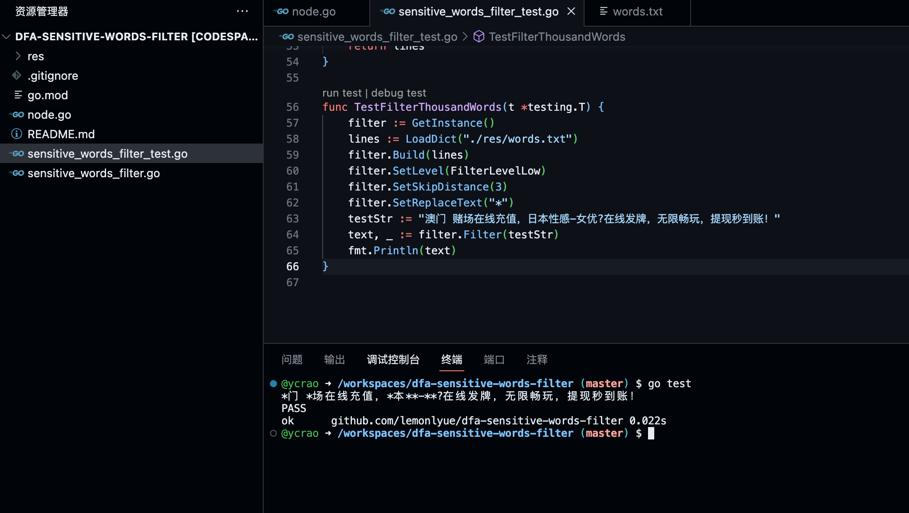
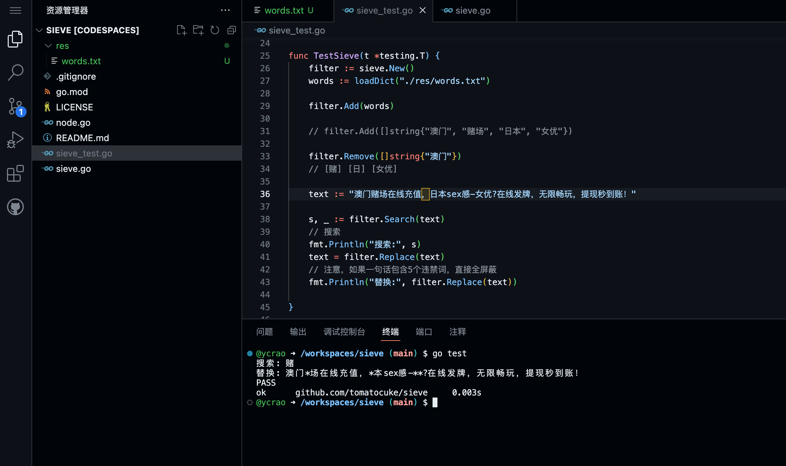
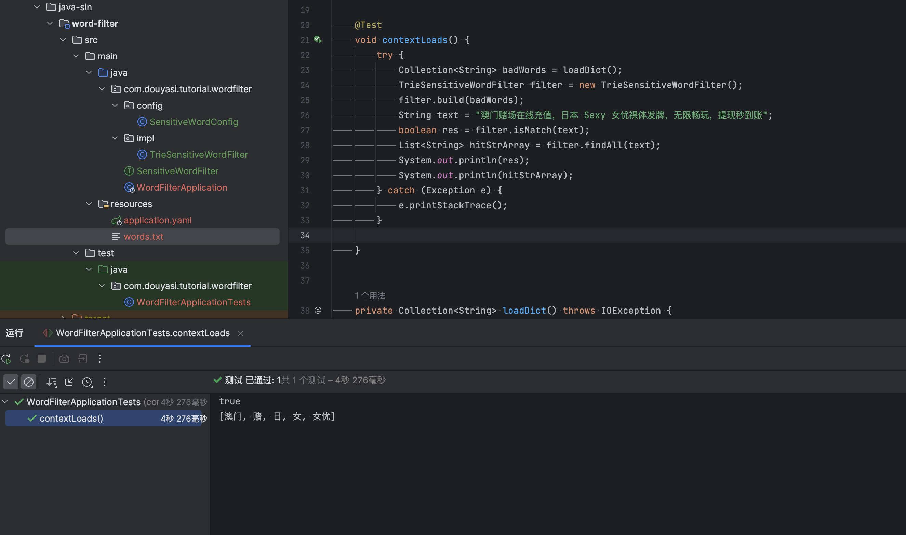

text-word
---------

>   基于 `Trie Tree` 实现的文本词检测与过滤方案。

### 测试敏感词

要达到较好的效果，就需要更全面的敏感词词库，敏感词词库主要依赖于网络收集。这里出于测试目的，只给出 1000 多条敏感词的数据，位于 `res/words.txt` 文件，囊括 `涉政`、`涉黄`、`涉毒` 以及 `广告` 等词汇。

- [cjh0613/tencent-sensitive-words](https://github.com/cjh0613/tencent-sensitive-words)
- [kikiakikia/keyword](https://github.com/kikiakikia/keyword)

### go-sln

实现一：fork 自 [lemonlyue/dfa-sensitive-words-filter](https://github.com/ycrao/dfa-sensitive-words-filter) ，追加了额外的测试代码。

实现二：fork 自 [tomatocuke/sieve](https://github.com/ycrao/sieve) ，追加了测试代码。

### java-sln

参考拷贝 [AnthonyZero/text-processor](https://github.com/AnthonyZero/text-processor) 相关代码实现，它引入外部依赖，一个基于双数组Trie树的AC自动机实现，效率较高，请查看 [AhoCorasickDoubleArrayTrie](https://github.com/hankcs/AhoCorasickDoubleArrayTrie) 了解更多。

关于AC自动机及失配指针等概念已故前端大佬司徒正美的[这篇文章](https://zhuanlan.zhihu.com/p/80325757)比较易懂。

### js-sln

